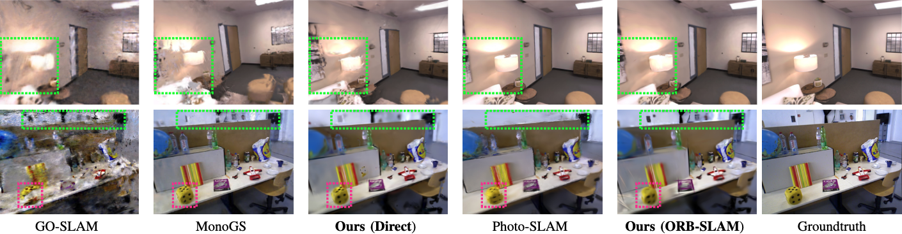

<h1 align="center">GEVO: Memory-Efficient Monocular Visual Odometry Using Gaussians</h1>

<p align="center">
    <strong>
        <a href = "https://scholar.google.com/citations?user=_loctXsAAAAJ">Dasong Gao</a><sup>*</sup>,
        <a href = "https://scholar.google.com/citations?user=2yMCkVQAAAAJ">Peter Zhi Xuan Li</a><sup>*</sup>,
        <a href = "https://eems.mit.edu/principal-investigator-vivienne-sze/">Vivienne Sze</a>,
        <a href = "https://karaman.mit.edu/">Sertac Karaman</a>
    </strong>
    <br>
    <i><sup>*</sup>Equal Contribution</i>
    <br>
    <strong>
        <a href = "https://lean.mit.edu">MIT LEAN</a>
    </strong>
</p>

<p align="center"><strong>
    <a href = "https://arxiv.org/pdf/2409.09295">📄 [Paper]</a><!-- |
    <a href = "">🌐 [Project Site]</a> |
    <a href = "">🎥 [Video]</a> -->
</strong></p>

<p align="middle">
  
</p>

Constructing a high-fidelity representation of the 3D scene using a monocular camera can enable a wide range of applications on mobile devices, such as micro-robots, smartphones, and AR/VR headsets. On these devices, memory is often limited in capacity and its access often dominates the consumption of compute energy. Although Gaussian Splatting (GS) allows for high-fidelity reconstruction of 3D scenes, current GS-based SLAM is not memory efficient as a large number of past images is stored to retrain Gaussians for reducing catastrophic forgetting. These images often require two-orders-of-magnitude higher memory than the map itself and thus dominate the total memory usage. In this work, we present GEVO, a GS-based monocular SLAM framework that achieves comparable fidelity as prior methods by rendering (instead of storing) them from the existing map. Novel Gaussian initialization and optimization techniques are proposed to remove artifacts from the map and delay the degradation of the rendered images over time. Across a variety of environments, GEVO achieves comparable map fidelity while reducing the memory overhead to around 58 MBs, which is up to 94$\times$ lower than prior works.

## :calendar: Code Release Schedule

Currently, the code is under-review by our sponsors and the Technology Transfer Office. We will release the code as soon as possible when the review is completed (early to mid 2025). Thank you for your understanding!

## :pencil: Citation

If you find our work useful in your research, please consider citing the following:

```bibtex
@article{gao2024gevo,
  title={GEVO: Memory-Efficient Monocular Visual Odometry Using Gaussians},
  author={Gao, Dasong and Li, Peter Zhi Xuan and Sze, Vivienne and Karaman, Sertac},
  journal={arXiv preprint arXiv:2409.09295},
  year={2024}
}
```